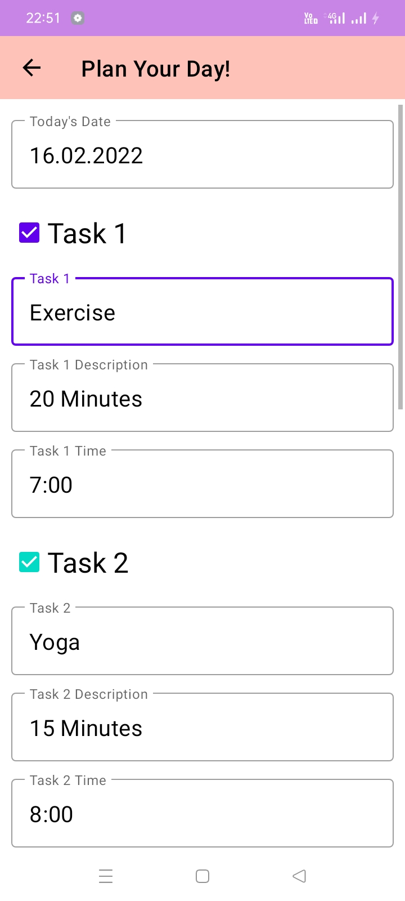
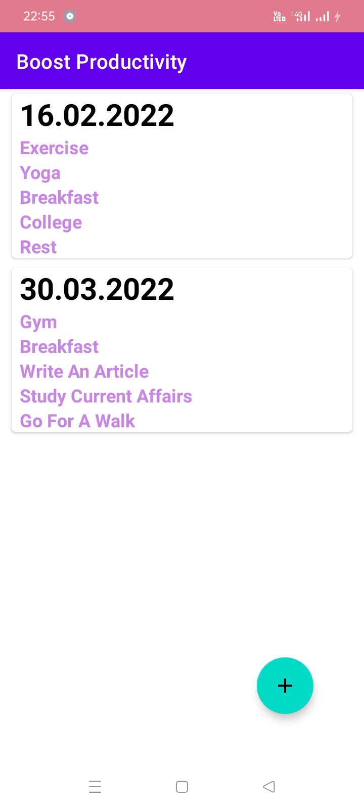
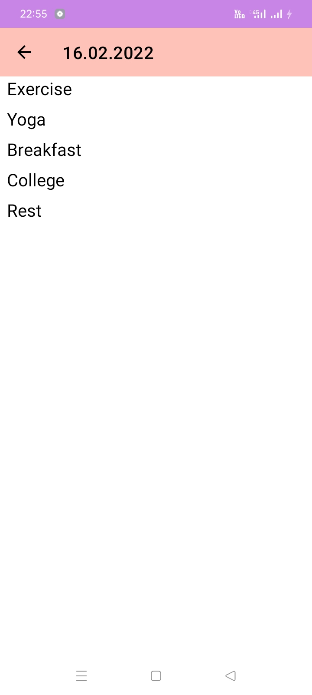

# <h1 align="center">Productivity Booster  App</h1>

 It's an app to store date-wise tasks with time and description.  
I have used SQLite Database to store data and added features like swipe 
to edit and swipe to delete.

<table>
    <thead>
        <tr>
          <th colspan="3"><b>Screenshots</b></th>
        </tr>
    </thead>
    <tbody>
        <tr>
            <td>Plan Your Day!</td>
            <td>All your plans at one place</td>
            <td>View Your Tasks</td>
        </tr>
        <tr>
            <td></td>
            <td></td>
            <td></td>
        </tr>
    </tbody>
</table>

